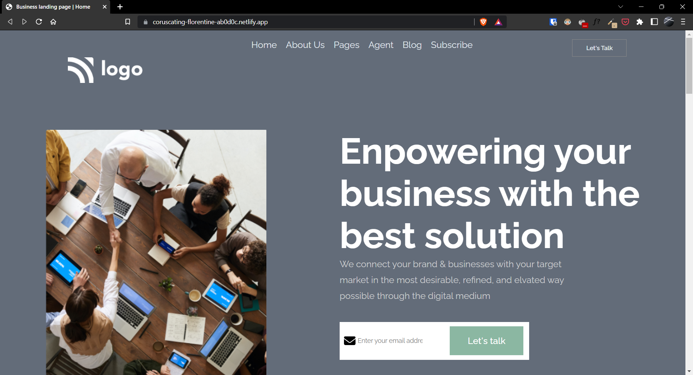
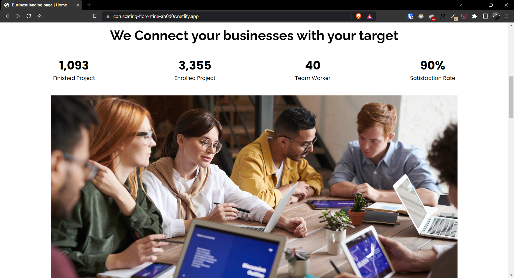
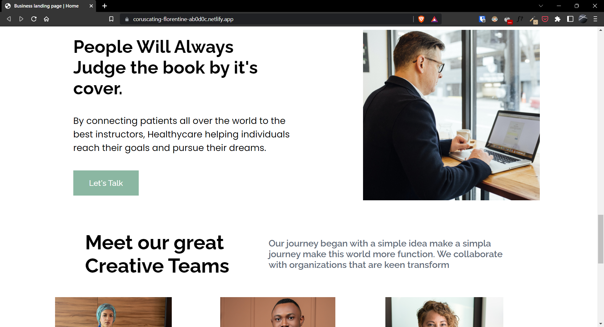
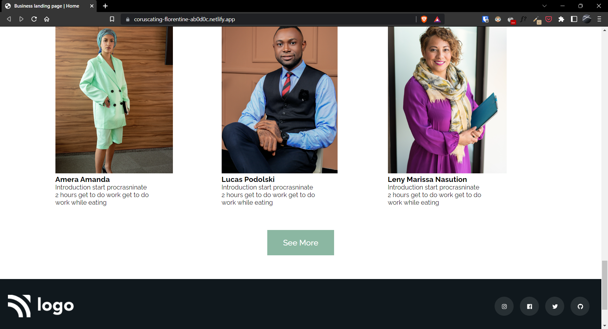

# Project-12 | Business Landing Page

Hi there,
I'm Wasit Ali and this is my 12th project on HTML and CSS.

## 🖥 Preview

🚀 [Live Preview](https://live-class-project-12-xi.vercel.app/)

## 🛠️ What I have learned in this project?

- Css flexbox usecase.
- Learnt about behaviour of an image element on different div sizes.
- Handled mobile Responsive With Media Queries.

## ⏲ Time taken to finish the project

- Around 20 hours
